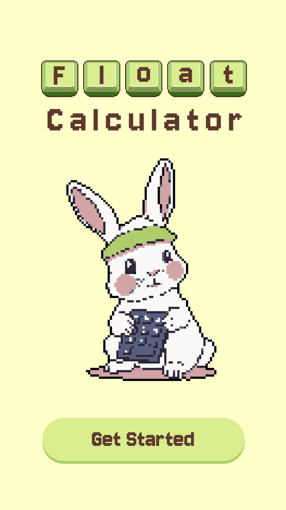
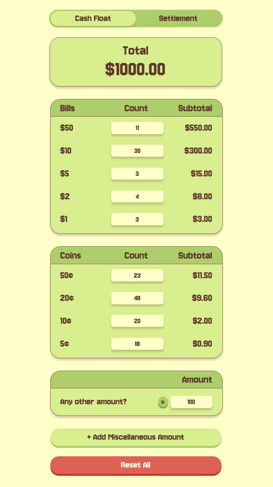
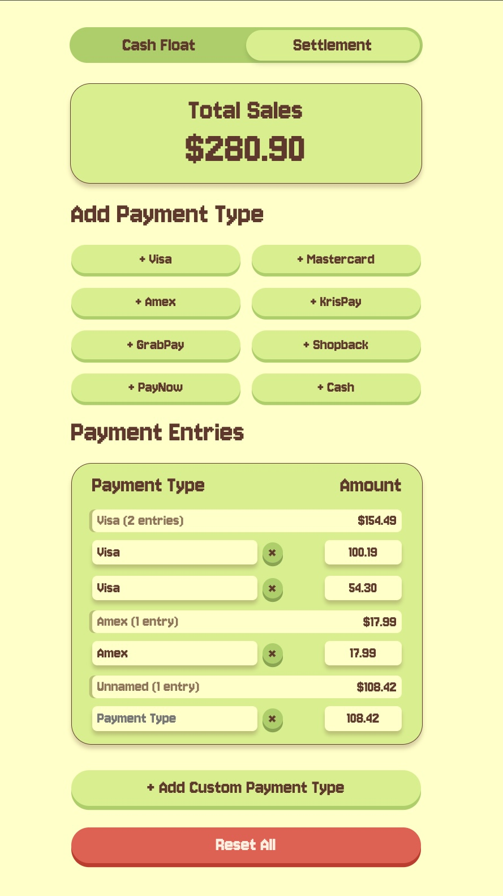

# Float Calculator 🍧

**Tired of fumbling with dollars and cents?**

Made for the people (like me) who need to quickly and accurately count cash floats. Whether you're closing the cashier for the day or doing a mid-day check, this app eliminates the headache of manual calculations, saving you valuable time and reducing the risk of errors.

**Stop struggling with the change—just count the quantities and let the app do the rest!** Simply input the total count of each coin and bill, and the Float Calculator will instantly provide the total value.

Yes, this could've been an excel sheet but where's the fun in that? 💛

Try the app here: [Float Calculator 🍧](https://floatcalc.vercel.app/)

Peek my Figma here: [Figma 🎨](https://www.figma.com/design/RwaWbGCGL0MEHQAgEI6Rij/Float?node-id=91-71&p=f&t=ZTGgKYp4yEpGzNd4-0)

## Features

- **Intuitive and Easy to Use:** Designed for quick and hassle-free data entry.
- **Mobile-Friendly**: Built with that squeezy cash register in mind. No bulky laptops required!
- **Add Any Other Amount**: Easily account for pre-counted or bundled cash. Perfect for those "standby" rolls of coins or stacks of bills.

### ✨NEW!✨ Calculate Settlement

Reconcile all your payments in one place. This feature removes the hassle of going back and forth between multiple card terminals. Simply input your payment totals as you see them from each terminal, and Float Calculator will instantly group them, giving you an overall subtotal and total sales to cross-check with your POS machine.

## Screenshots

_**Your Go-To App for Counting Cash Float**_

_**It's that quick and easy!**_

_**No more juggling of terminals!**_

## Attributions & Credits

- Title screen image generated by [Pixie Haus](https://pixie.haus/)

## Next Steps

I'm always looking to improve the Float Calculator! Upcoming enhancements include:

- **Improved Mobile Optimisation:** Have yet to master responsive design, so my next priority is to refine the mobile layout for optimal viewing and usability on all screen sizes.
