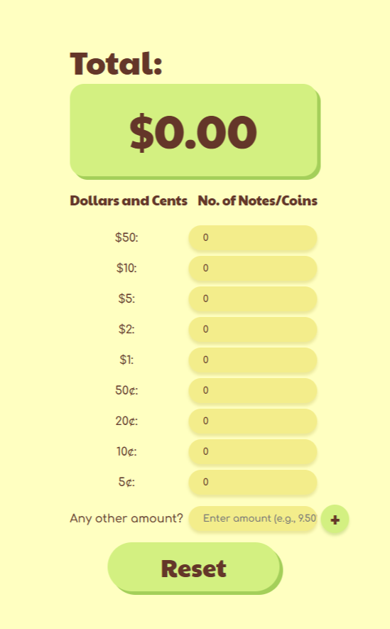

# Float Calculator 🍧

**Tired of fumbling with dollars and cents?**

Made for the people (like me) who need to quickly and accurately count cash floats. Whether you're closing the cashier for the day or doing a mid-day check, this app eliminates the headache of manual calculations, saving you valuable time and reducing the risk of errors.

**Stop struggling with the change—just count the quantities and let the app do the rest!** Simply input the total number of each coin and bill denomination, and the Float Calculator will instantly provide the total value.

Yes, this could've been an excel sheet but where's the fun in that? 💛

## Features

* **Intuitive and Easy to Use:** Designed for quick data entry.
* **Mobile-Friendly**: Because let's be real, nobody's counting cash with a bulky laptop. But hey, you do you!
* **Add Any Other Amount**: Easily account for fixed amounts of cash in your float without needing to count individual pieces.

## Screenshots

_**Your Go-To App for Counting Cash Float**_

_**It's that quick and easy!**_

## Attributions & Credits
* Art by [Kris Swan](https://www.instagram.com/krisswanart)